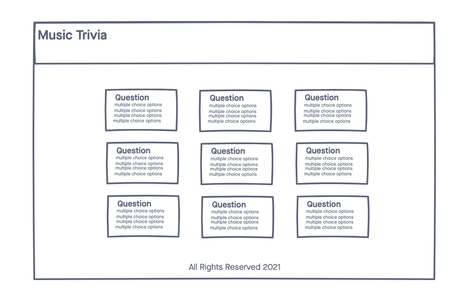
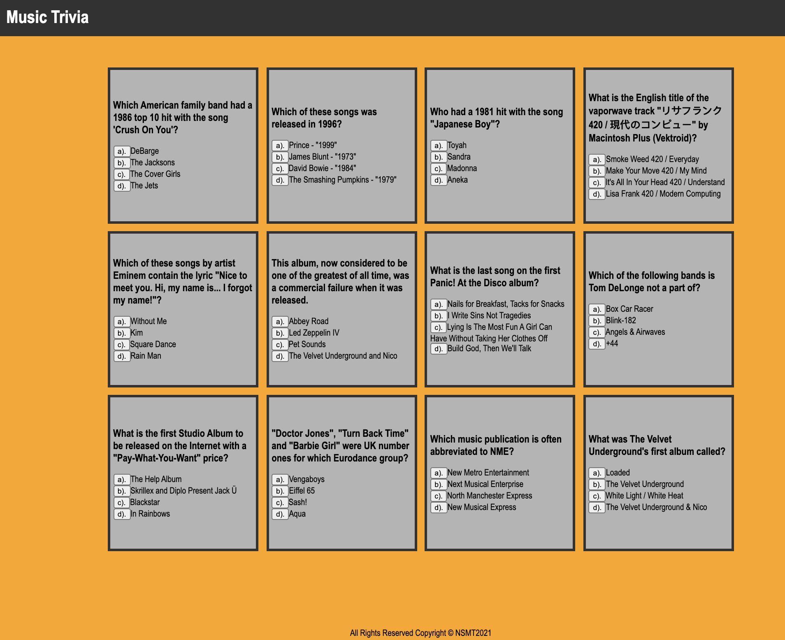

# Music Trivia

Do you live for New Release Fridays on music platforms? Do you watch recaps of the Grammy's to find out who won various awards? Here's a simple web app that asks fun trivia questions for music lovers.

## Technologies
- HTML5
- CSS3
- JavaScript
- jQuery
- Trivia Database API

## Screenshots
Here is the wireframe.
 

Here is a screenshot of the app. 
 

## Getting Started
[Click here]('https://niladrisgithub.github.io/musicaltrivia/') to get started!

## Future Enhancements
One thing to change for the future is to have the multiple choice elements mixed around instead of the correct answer being listed in the same spot for each question. 
Another element to work on for the future, is to have a question card disappear after the user has answered the question correctly.